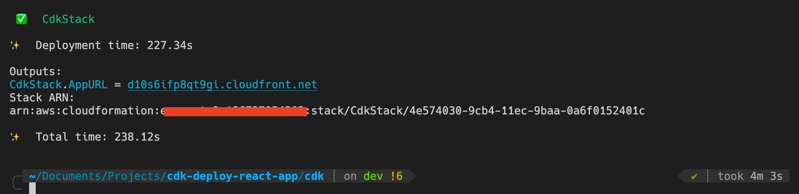
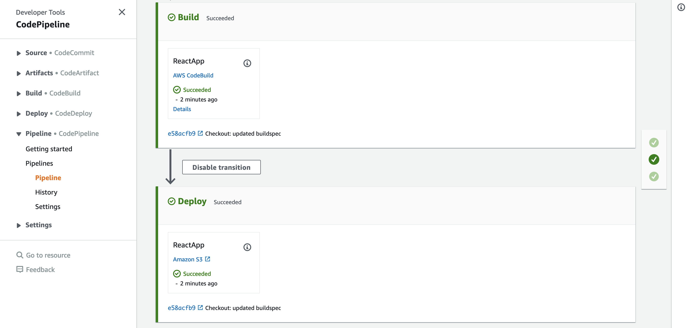
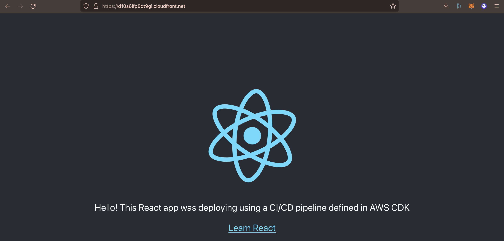

# Deploy a React app to CloudFront and S3 using AWS CDK and CodePipeline

## Install and setup the AWS CLI and ensure your user has the relevant permissions

For a quick setup guide, follow the instructions [here](https://docs.aws.amazon.com/cli/latest/userguide/cli-chap-getting-started.html).

## Setup a GitHub repository for 'my-react-app'

The source code comes with a basic React app created using CRA. Version control it on GitHub as either a private or public repo. Feel free to replace it with your own app.

## Generate a Personal Access Token for your GitHub account

Required for CodePipeline to detect repo changes and create the necessary artifacts. More information on how to create one [here](https://docs.github.com/en/authentication/keeping-your-account-and-data-secure/creating-a-personal-access-token)

## Store your Personal Access Token in AWS Secrets Manager

You can do this either using the console or the CLI

```console
aws secretsmanager create-secret \
    --name <NAME-YOUR-TOKEN> \
    --secret-string <REPLACE-WITH-YOUR-TOKEN> \
    --region <REPLACE-WITH-YOUR-AWS-REGION>
```

## Customize the CDK configuation

In `/cdk/bin/cdk.ts`, update the props passed to the stack to match your GitHub username, repository / main branch name, region and the name of your GitHub token on AWS Secrets Manager. Note: ensure that the secret stored in AWS Secrets Manager is in the same region where you want the resources deployed.

```ts
new CdkStack(app, "CdkStack", {
  github: {
    owner: "hvmzajahangir",
    repository: "my-react-app",
    branch: "main",
  },
  env: { region: "eu-west-2" },
});
```

## Build the CDK app

Run this the first time you're depolying the stack and whenever you make changes to the CDK code.

```console
cd cdk
npm run build
```

## Bootstrap the CDK app

The AWS CDK uploads the stack assets to an Amazon S3 bucket or other container so they are available to AWS CloudFormation during deployment. Deployment requires that these containers already exist in the account and region you are deploying into. Creating them is called bootstrapping. You only need to run this during your first stack deployment.

You don't need to specify the account number and region if you want to bootstrap the app in the same region defined when you configured your AWS CLI user.

```console
cdk bootstrap aws://<YOUR-ACCOUNT-NUMBER>/<YOUR-REGION>
```

## Deploy the stack

After running the following commands, wait for your resources to be deployed (you will see a CloudFront domain name appear in the console once done). You also need to wait for CodePipeline to finish all three pipeline stages. You can monitor this in the AWS console.

```console
cdk synth
cdk deploy
```

## Visit the web app!

After the CodePipeline has finished executing, grab the CloudFront distribution domain and visit your website. Any subsequent changes commited to the branch you defined in the configuration will trigger the pipeline again and deploy the changes.







## Clean up

Use `cdk destroy` once done to destroy the resources created by the stack to ensure you don't run into unexpected costs.

Note that AWS will retain all the S3 buckets and their content. Either manually delete these via the console or setup a retention policy in the resource definition to destroy the objects and the bucket on stack deletion.
